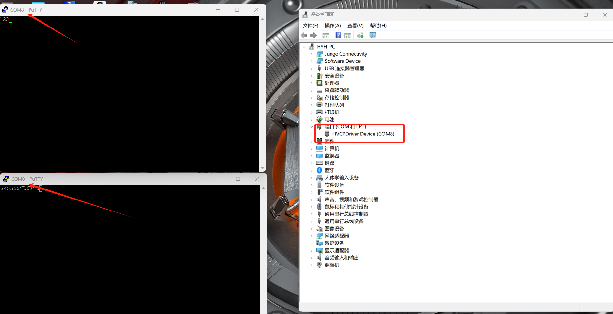

# 说明

Windows下虚拟串口驱动。

特点如下:

- 将产生一个虚拟串口，且可同时被多个进程打开。
- 写入的数据将重新发送到所有打开该串口的进程（不包括自身）。

已知问题:

- 当打开该进程的进程数过多时将出现问题,最多支持打开的进程数由源代码决定(默认为32)。
- 同一进程不可多次打开该串口，否则会出问题。
- 某些串口工具可能不兼容。

# 目录说明

- [prebuilt](prebuilt):预构建的二进制文件，包括需要用到的工具、DDK的redist包中的文件及由源代码编译的驱动文件
- [HVCPDriver](HVCPDriver):驱动源代码

# 驱动安装

由于驱动未签名，故而64位操作系统需要先进入高级启动关闭驱动强制签名(安装完成后不再需要保持此模式)。

驱动跟操作系统的架构需要一一对应，不可混用。

## 安装

见驱动目录下的install.cmd,在具有管理员权限的cmd执行该脚本即可成功,每执行成功一次将产生一个虚拟串口。

注意:

- 一定要使用管理员权限的cmd，进入install.cmd所在目录后再运行install.cmd,再某些高版本windows中直接运行install.cmd可能不能正确安装。
- 若仅是简单测试，可再虚拟机中安装windows xp及windows 7的32位版本(i386)进行测试。

## 卸载

见驱动目录下的remove.cmd,在具有管理员权限的cmd执行该脚本即可成功,将删除所有虚拟串口。

# 截图

